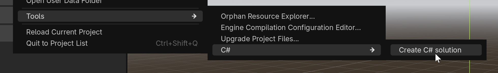
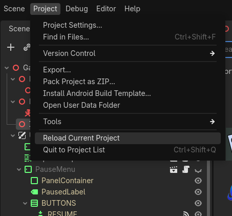

G.U.I.D.E (Godot Unified Input Detection Engine) is an extension for the Godot Engine that allows you to easily use input from multiple sources, such as keyboard, mouse, gamepad and touch in a unified way. Gone are the days, where mouse input was handled differently from joysticks and touch was a totally different beast. No matter where the input comes from - your game code works the same way.

_Note: This version utilises a C# Wrapper originally made by @DFGameDev. If you do not need C# support for G.U.I.D.E, visit the main repository [HERE](https://github.com/godotneers/G.U.I.D.E)._

---

G.U.I.D.E-CSharp has full functionality on its own, see the [changelog](CHANGES.md) for current version information.

**This plugin includes:**
- The C# wrapper
- The full guide plugin as a [sub-plugin](https://docs.godotengine.org/en/stable/tutorials/plugins/editor/making_plugins.html#using-sub-plugins).
    - The [GUIDE](https://github.com/godotneers/G.U.I.D.E) portion included in this plugin will be kept up to date with releases.

## Quick Start

1. Make sure you are using the **C# version of Godot** (Godot-Mono/GodotSharp) and it is **at least version 4.2** or greater.
1. Aquire the plugin using one of the following:
	- Use the asset browser within Godot (Search "unified")
	- [Godot Asset Store](https://godotengine.org/asset-library/asset/5104)
	- [Repository Releases](https://github.com/Phlegmlee/G.U.I.D.E-CSharp/releases)
1. Build your project, C# is a compiled language so you must build the C# portion of the plugin.
    

     
    
If build option is missing:

     
    
Use Project > Tools > C# > Create C# Solution

    
    
After the solution is created, the build option should show up.

    

1. Enable GUIDE-CSharp in your Project > Project Setting > Plugins list.
    

    
    

1. Restart your project.
    

    
    

### Read Next -> [Usage](usage.html)

#### Read Next -> [G.U.I.D.E Docs (External)](https://godotneers.github.io/G.U.I.D.E/)

---

## [Issues](https://github.com/Phlegmlee/G.U.I.D.E-CSharp/issues)
If you have any problems while using this plugin, create an [issue](https://github.com/Phlegmlee/G.U.I.D.E-CSharp/issues). All issues should be created in the G.U.I.D.E-CSharp repository, **even if the problem seems to be from the base G.U.I.D.E plugin, all issues related to the use of this plugin should stay within this repository.**

---

## [Gotchas](gotchas.html)
- See the quirks of usage, the problems that have yet to be solved or can't be solved.
