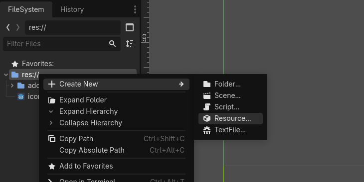
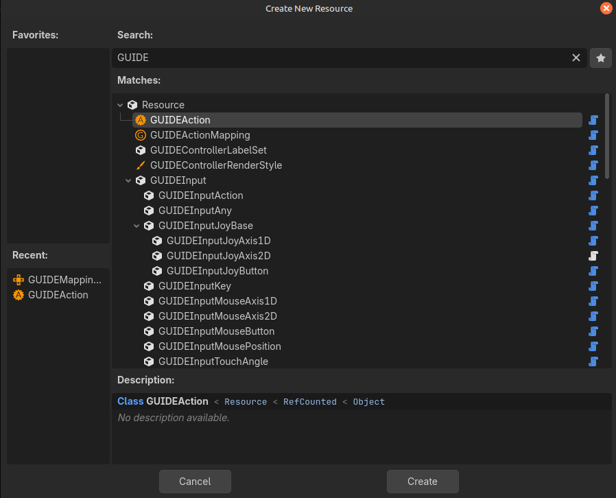
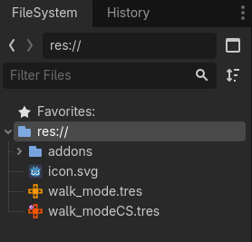
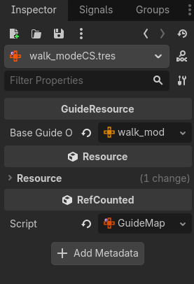
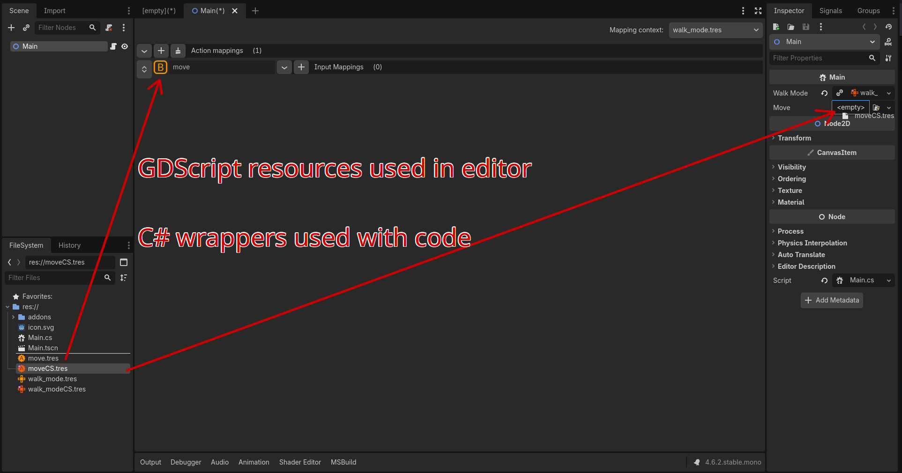

## Usage

G.U.I.D.E-CSharp is designed to follow all the normal behavior of G.U.I.D.E, so most of what you do with the wrapper is exactly the same other than using CamelCase instead of snake_case.

```cs
// GDScript
    GUIDE.enable_mapping_context();

// C#
    Guide.EnableMappingContext();
```

C# Editor resources are handled with a duplicate resource type, denoted by the **blood orange** color variation and a C# icon.


Anything done directly in the editor, use GUIDE resources as normal.

Anything done in C#, use a GuideCs resource.

## Workflow Tutorial

1. Create a `GUIDEAction` or `GUIDEMappingContext`.
  
  
1. The matching C# wrapper is created automatically.
  
1. The C# wrapper **automatically** takes the matching`GUIDEAction` or `GUIDEMappingContext` as an export parameter.
  
1. In your C# script, create your `[Export]` variables as GuideCs types.
    ```cs
      using Godot;
      using GuideCs;

      public partial class Main : Node
      {
        [Export] public GuideMappingContext WalkMode;

        [Export] public GuideAction move;

        
      }
    ```
1. Assign them in the editor with your GuideCs wrappers:
  
1. Use them in C# as you would in GDScript, keeping in mind the differences with C#. See the [C# documentation](https://docs.godotengine.org/en/4.6/tutorials/scripting/c_sharp/index.html).
    ```cs
      using Godot;
      using GuideCs;

      public partial class Main : Node
      {
        [Export] public GuideMappingContext WalkMode;

        [Export] public GuideAction move;
        
        public override void _Ready()
        {
          Guide.EnableMappingContext(WalkMode);
        }
        
      }
    ```

## Code Only Examples


### No Exports

If you don't use `[Export]` properties and would prefer to load and manage your C# resources through code, you can also do so by using the `Utility.CreateWrapper()` function to generate wrapped resources:

```cs
    public Dictionary<string, GuideAction> WrappedActions;
    public override void _Ready()
    {
        Dictionary<string, string> guideActions = new ()
        {
            {"Jump", "uid://cm76dijjo3wm4"},
            {"Shoot", "uid://cki32mfnd6v7k"},
            {"walk", "uid://c0quxwokh6bm4"},
        };

        foreach (var kvp in guideActions)
        {
            var guideBaseObject = (GodotObject)ResourceLoader.Load<GDScript>(kvp.Value).New();
            var wrappedAction = Utility.CreateWrapper<GuideAction>(guideBaseObject);
            WrappedActions.TryAdd(kvp.Key, wrappedAction);
        }
        
        base._Ready();
    }
```
### Direct Creation
These examples are **NOT** the only way, there are much better ways, keeping the code examples more readable was priority here.

#### You can also directly create the wrapper depending on how you prefer to manage your resources.
```cs
    GuideResource.ConnectBaseGuideResource()

    // or
    
    GuideResource.LoadAndConnectBaseGuideResource() 
```

#### If you loaded your own object(s), use connect.
```cs
public partial class Main : Node2D
{
  public List<GodotObject> BaseGuideMappingContextsLoaded = [];

  public override void _Ready()
  {
    var wrappedMappingContext = new GuideMappingContext();
    wrappedMappingContext.ConnectBaseGuideResource(BaseGuideMappingContextsLoaded[0]);
  }
}
```

#### If you want GuideCs to load the object(s) for you, use load and connect.
```cs
public partial class Main : Node2D
{
  public List<string> BaseGuideMappingContextPaths = [];

  public override void _Ready()
  {
    var wrappedMappingContext = new GuideMappingContext();
    wrappedMappingContext.LoadAndConnectBaseGuideResource(BaseGuideMappingContextPaths[0]);
  }
}
```

#### You can also create a new object and pass the loaded GUIDE resource as a constructor parameter.
```cs
public partial class Main : Node2D
{
  public override void _Ready()
  {
    var loadedGuideObject = (GodotObject)ResourceLoader.Load<GDScript>("uid or path").New();
    wrappedMappingContext = new GuideMappingContext(loadedGuideObject);
  }
}
```

**Note: GuideCs cannot verify the GUIDE object type:**
- `get_class()` and `is_class()` return the Godot inherited class **not** `class_name`.
- This means that G.U.I.D.E-CSharp references everything as a `GodotObject`.
- You can load the GUIDE content as anything needed using casting without issue.


### Read Next -> [G.U.I.D.E Docs (External)](https://godotneers.github.io/G.U.I.D.E/)

### Read Next -> [Gotchas](gotchas.html)
